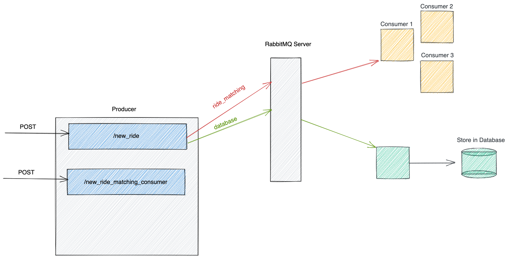

# Building Microservice Communication With RabbitMQ

## Introduction

The microservice architecture is one of the most popular forms of deployment, especially in larger organisations where there are multiple components that can be loosely coupled together. Not only does this make it easier to work on separate components independently, but ensures that issues in one component does not bring down the rest of the service. A microservices architecture consists of a collection of small, autonomous services where each service is self-contained and should implement a single business capability within a bounded context. This also comes with the advantage that a single system can scale thereby limiting the resources to required components. For example, during a shopping sale, the cart and payment microservices might need more resources than the login microservice. However, one of the issues that comes up with microservices is inter-service communication. There is a need to send messages asynchronously and reliably across services, such that they’re delivered even in case of network delays or one of the services failing to receive it immediately. For this reason, we use messaging queues. A message queue is a form of asynchronous service-to-service communication used in serverless and microservices architectures. Messages are stored on the queue until they are processed and deleted. Each message is processed only once, by a single consumer.

## Pre-requisites

- Docker( [Windows](https://docs.docker.com/desktop/windows/install/) | [Ubuntu](https://docs.docker.com/engine/install/ubuntu/#:~:text=Install%20from%20a%20package&text=Go%20to%20https%3A%2F%2Fdownload,version%20you%20want%20to%20install) | [MacOS](https://docs.docker.com/desktop/mac/install/) )
- RabbitMQ Docker Image
  - <https://hub.docker.com/_/rabbitmq>  
It is advised to pull the images into your system before the day of the hackathon because of the network dependency and other uncertainties.
- Support for language of choice + IDE

While you’re allowed to use any language of choice for the project, ensure there are RabbitMQ Client libraries available for your language of choice. We will suggest libraries to use for Python/NodeJS to set up different components of the project, but you may use any library to the same effect.

## Deliverables

In this project, we’ll be taking a look at building and deploying a microservice architecture where multiple components communicate with each other using RabbitMQ. Let’s take the example of Uber - the ride-sharing app. When you send a request to book a ride, the system gets your location and tries to match you with riders near your location. Since this is time-consuming, there might be a microservice that tries to do the user-ride matching in the background so that none of the other functionality is tied up for other users. Similarly, there might be a microservice responsible for inserting your ride request into the database. For this project let’s consider 3 microservices - an HTTP server that accepts your requests for a ride, a microservice that tries to calculate the best drivers for the user (we won’t go into actual ride-matching, just simulate the time taken), and a microservice that inserts the data into a database. Moreover, we want the ride-matching microservice to be highly scalable so even if there are a lot of requests, we can just add new containers and they take over (we won’t be automating new containers, but when manually adding new containers, they should be able to connect to the network and accept tasks)

## Instructions

1. Spin up a RabbitMQ docker container and ensure the required ports are exposed to enable connections from other services.

2. We’ll be creating the producer first. It has 3 main components -
	1.  An HTTP server to listen to ride requests so it can distribute that to consumers. The Path for this API will be `new_ride`
		1. You are recommended to use Flask with Python, or Express with NodeJS to create the server, but are allowed to use any language/library they you are most familiar with as long as it satisfies the same purpose
		2. The request to this endpoint will be of type POST and contain some information about the ride being requested, like - 
			1. pickup
			2. destination
			3. time - Let this be the time in seconds that the consumer microservice will sleep for when data is received. Rest of the fields can be any data
			4. cost
			5. seats
		
	2. An HTTP server to listen to connection requests from new consumers and keep track of it. The endpoint for this will be `new_ride_matching_consumer`
		1. This will just be a different path of the same HTTP server, or they can spawn it on a different port if they want to.
		2. This will be listening to POST requests from new consumers that contains the consumer_id and store their IP address and name. The Name and IP address will just be stored as a map, in an array, where each map has name and IP as the keys, and the consumer_id and the request IP as the values
		   
	3. A RabbitMQ client to create queues and send the data to consumers. The RabbitMQ client in the producer will register a new queue each for the ride-sharing consumer microservice and one for the database microservice, and will be responsible for sending out the data from the POST requests to consumers. 

3. The “Ride-mapping” consumer has 3 main tasks -
	1. When the program is started, it should read the server’s IP address and port from an environment variable, and the consumer’s ID from another environment variable which will be provided. This variable should be passed in the docker file when it’s being run. It should send an HTTP request to the producer registering itself as a consumer by sending the consumer ID and only then start accepting data from the RabbitMQ queue.

	2. RabbitMQ Client - Listen for incoming requests on the “ride_match” queue and process it. 
	   
	3. Sleep for the required time. Each request to the consumer will contain a time in seconds. The entire process must sleep for that duration and not take in any new requests, done to simulate the micro-service being occupied with some task and being unable to take up new tasks. After it’s done sleeping, it should print the Task ID and consumer ID to the terminal.
	   
4. The “database-inserting” consumer will have only one task, storing the data in a database. Any database of choice can be used. The program will connect to RabbitMQ and listen to new mesages on the “database” queue, and on new requests it will insert the ride data into a database.
 
5. Dockerize the application. Create Dockerfiles for the producer and consumer programs, ensuring to expose the appropriate ports for communication.

6. Create a docker-compose file that runs the RabbitMQ server, producer, one database microservice container, and 2 ride-matching containers. The producer’s IP and port must be passed as an environment variable to the ride-matching containers so they can use it to send the request.

7. The docker-compose file should have a custom docker network that all these containers use. This will ensure that more consumer containers can be added externally by connecting them to the same network.

8. Run the docker-compose files, send data to the producer and monitor the consumers to ensure they’re working properly.

## Some Notes To Consider
1. When you build the docker-compose file, and run the entire microservice from there, sometimes your RabbitMQ consumers might fail because the RabbitMQ server is still booting while your program tries to connect immediately. Therefore, try adding a delay of 1 minute or so in your code, before the rest of the program starts running. This will give the RabbitMQ server and database you're using time to boot, before your code tries to interact with them. 

2. Ensure the values like Consumer Name and Server URL being passed to the consumers are read from the system environment variables, and not hard-coded.

3. The `app` folder contains the recommended file structure for the project. While you're free to setup the project in any way you like, we recommend that you follow the structure of the `app` folder.

