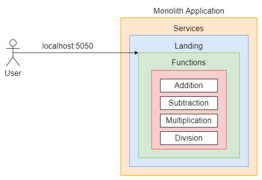
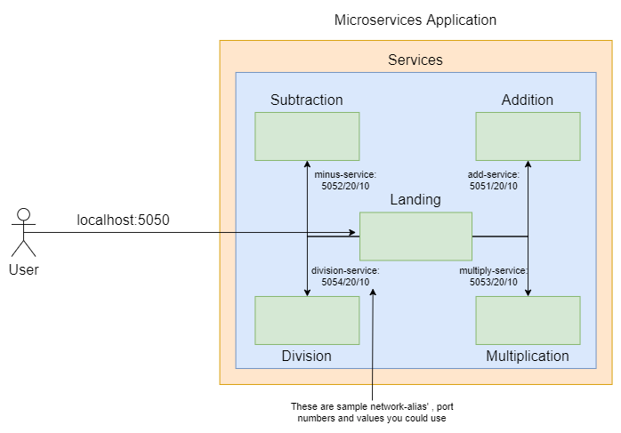

# Problem Statement 3 - Breaking down monoliths 🪨⛏️

This problem statement has two objectives:
- Get familiar with reading error stack trace and debugging code.
- Convert a monolith architecture based docker-compose application into a microservices based architecture.  

## Requirements:
- [docker](https://docs.docker.com/engine/) and [docker-compose](https://docs.docker.com/compose/install/). Follow the guides based on your operating system.
- Internet. Pull docker image `python:3.8-alpine` beforehand to avoid connectivity issues.

## Initial directory structure
```
├── README.md
├── docs
│   └── <documentation related images/files>
├── microservices
│   ├── Docker-compose.yaml
│   ├── landing
│   │   ├── app
│   │   │   ├── app.py
│   │   │   ├── requirements.txt
│   │   │   └── templates
│   │   │       └── index.html
│   │   └── Dockerfile
│   │
```
## Monolith architecture diagram
<p align="center">
  
</p>

## Build & Run
```
# under the microservices directory
# NOTE: For any code changes to be reflected, the build command must be rerun, and then up
docker-compose build
# run without the -d flag incase you want to observe the logs
docker-compose up -d
```
### To stop the services in detached mode
```
docker-compose down
```

**NOTE**: It is possible your first build will not be successful and that's alright. Read the stack trace and debug the errors. The resources and links provided within the manual are sufficient to successfully complete the project.

## Tasks
0. ### Task-0 - Completing the code 👨‍💻👩‍💻
    #### 0.0. Add modules to ```landing/app/requirements.txt```
      - The following modules are required by the ```landing-service```:
      - ```flask```
      - ```flask-restful```
      - ```requests```
    #### 0.1. Write the ```landing/Dockerfile```
      - Dockerfiles help building images using a given set of instructions. You can learn about the basics of Dockerfiles [here](https://docs.docker.com/engine/reference/builder/). Use this document to understand the meaning of certain keywords used by Dockerfiles.
      - For this project, you need to write a Dockerfile for a python application. I have provided sample Dockerfiles [here](https://docs.docker.com/language/python/build-images/) and [here](https://hasura.io/blog/how-to-write-dockerfiles-for-python-web-apps-6d173842ae1d/). 
      - Specifications for the ```Dockerfile```:
          - Use the image ```python:3.8-alpine```
          - Copy the contents of ```./app/requirements.txt``` to ```/app/requirements.txt```
          - Set the working directory to ```/app```
          - Run the following command: 
            ```
            apk add --update \
            && pip install --upgrade pip  \
            && pip install -r requirements.txt \
            && rm -rf /var/cache/apk/*
            ```
          - Copy the contents of the ```./app``` to ```/app``` folder
          - Run the command ```python app.py```
1. ### Task-1 - Debugging 🐛🔨
    #### 1.0. Fix the variable type of the incoming values from index.html
      - By default, Python considers all input as string. Due to this, the arithmetic operations do not seem to be working as intended. 
      - Fix the type of the two variable values received from ```index.html```
    #### 1.1. Handle the None type exception 
      - This bug is observed only after fixing the previous bug.
      - By default, no values are based on ```index.html```, causing the application to throw exceptions and crash.
      - Avoid the crash by handling the exceptions raised in the landing-service app.

2. ### Task-2 - Breaking the monolith architecture 🪨⛏️
    #### 2.0. Decouple the arithmetic functions from landing-service.
      - The four arithmetic functions currently reside under landing-service. However, if landing-service were to become unavailable for whatever reason, the four functions would be unavailable as well.
      - Create separate flask applications, Addition, Subtraction, Multiplication and Division. Each application will consist of a class which inherits the ```Resource``` class of ```flask_restful``` module. 
      - Define a GET method within the class with necessary parameters. An example of this class with the method defined can be found [here](https://stackoverflow.com/questions/25098661/flask-restful-add-resource-parameters) and [here](https://lovelace.oulu.fi/ohjelmoitava-web/programmable-web-project-spring-2019/implementing-rest-apis-with-flask/)
      - Use the ```add_resource``` function to add the class as a resource and define the API endpoint. Make sure to also mention the type of the parameters in the endpoint. 
       Example: ```api.add_resource(<class-name>, '/<int:argument0>/<int:argument1>')```
      - Update the ```Docker-compose.yaml``` to recognize the newly added flask applications as separate services. **The ```Docker-compose.yaml``` lets you define the port number and network alias that will be used by ```landing-service``` to communicate within the entire architecture**
       - Test the new microservices-based application. 
    #### 2.1. Add three more services
      - Proceed to add three more services that perform a certain function. You will also have to make changes to the frontend defined in ```index.html``` to make these functions available. Mentioned below are possible functions you could implement but feel free to add your own.
      - ```gcd```: Takes two numbers as arguments and returns their [Greatest Common Divisor](https://en.wikipedia.org/wiki/Greatest_common_divisor)
      - ```lcm```: Takes two numbers as arguments and returns their [Least Common Multiple](https://en.wikipedia.org/wiki/Least_common_multiple)
      - ```modulus```: Returns the remainder of two numbers after division. [Reference](https://en.wikipedia.org/wiki/Remainder)
      - ```exponent```: Returns the result of the arithmetic operation a<sup>b</sup>
      - ```greater_than```: Return ```True``` if the first value is greater than the second else ```False``
      - ```less_than```: return ```True``` if the first value is less than the second else ```False```
      - ```equal```: return ```True``` if the first value is equal to the second else ```False```


## Microservices-based architecture diagram
<p align="center">
  
  
<h7 align="center">The diagram only shows the services already defined within the microservice architecture for visualization purposes. You still need to add services of your own.</h7>

</p>


## Miscellaneous
- Directory structure of additional arithmetic microservices you will be adding:
```
├── <name of the service>
│   ├── Dockerfile           # same as landing/Dockerfile
│   ├── app
│   │   ├── app.py           # TODO: by yourself
│   │   └── requirements.txt # same as landing/app/requirements.txt
│   │  
```


